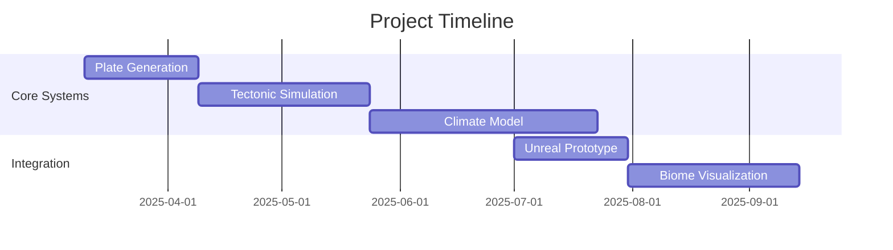

# AeonTerra Development Phases

## Phase 1: Core Simulation (Q2 2025)
- Voronoi plate generator implementation
- Basic mantle convection model
- Heightmap generation from plate collisions

## Phase 2: Environmental Systems (Q3 2025)
- Hydraulic erosion pipeline
- Atmospheric circulation model
- Biome classification system

## Phase 3: Unreal Integration (Q4 2025)
- Landscape material system
- Dynamic LOD terrain
- Climate visualization tools