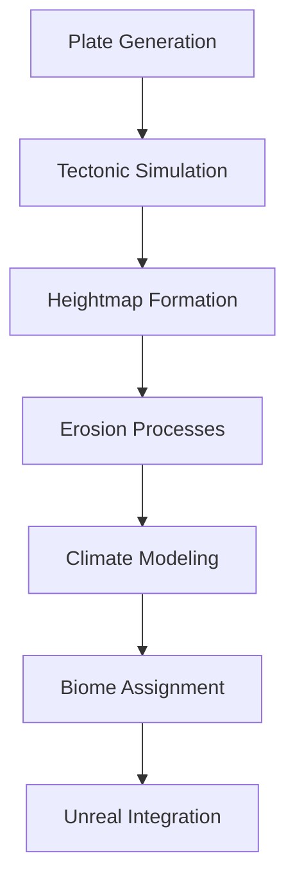

# AeonTerra Procedural Planet Architecture

## Core Subsystems

### 1. Voronoi Plate Generator
- Spherical Voronoi tessellation
- Plate buoyancy parameters
- Initial velocity vectors

### 2. Mantle Convection Model
- Heat transfer simulation
- Convection cell formation
- Plate boundary forces

### 3. Hydraulic Erosion Pipeline
- Precipitation-based erosion
- Sediment transport
- Thermal weathering

### 4. Atmospheric Circulation
- Hadley cell simulation
- Ocean current modeling
- Precipitation calculation

### 5. Biome Classification
- Köppen climate adaptation
- Altitude zoning
- Fantasy biome overrides